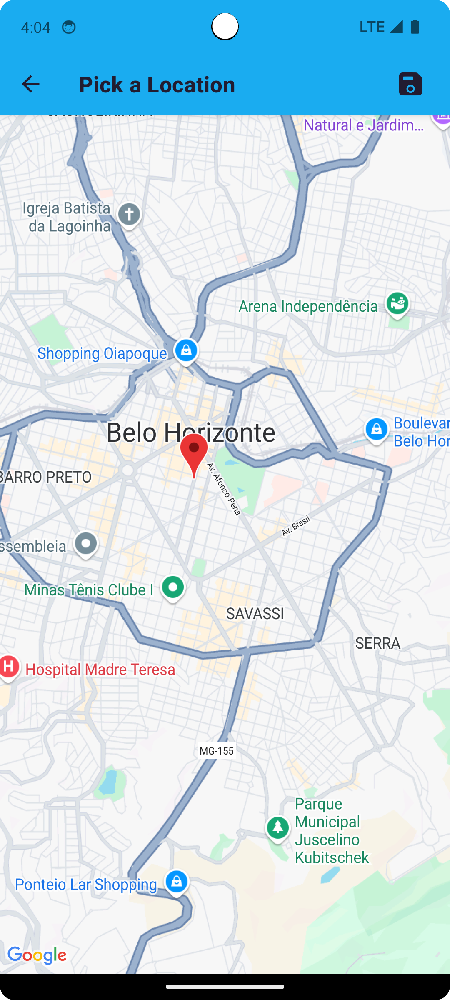
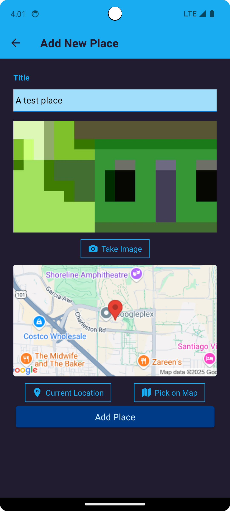
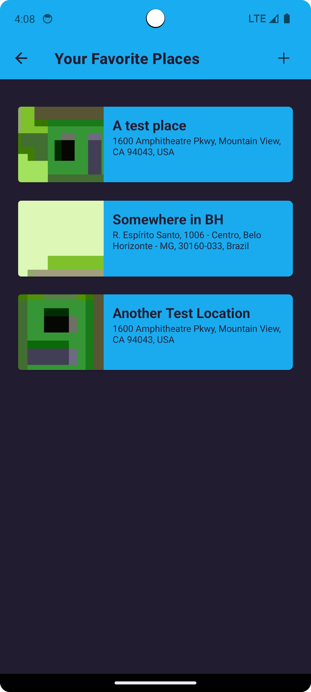

# FavoritePlaces 🌍📍

[](https://reactnative.dev/)
[](https://expo.io/)
[](https://developers.google.com/maps)

Aplicativo para salvar lugares favoritos com:
- Captura da localização atual
- Seleção manual no mapa
- Fotos do local
- Conversão de coordenadas para endereço (geocoding reverso)

<p align="center">
  
  
    
</p>

## 🛠 Tecnologias Utilizadas

**Núcleo:**
- React Native + Expo
- Context API (gerenciamento de estado)

**Localização:**
- Expo Location (GPS)
- Google Maps Static API (mapas)
- Google Geocoding API (endereços)

**Mídia:**
- Expo Image Picker (câmera/galeria)

**Armazenamento:**
- Expo SQLite 

## ✨ Funcionalidades Principais

- **Integração com Mapas**:
  - Visualização de mapas estáticos
  - Seleção manual de localização
  - Detecção da posição atual

- **Captura de Mídia**:
  - Acesso à câmera e galeria
  - Compressão de imagens
  - Armazenamento local

- **Gerenciamento de Dados**:
  - Geocoding reverso (coordenadas → endereço)
  - CRUD de lugares favoritos
  - Persistência offline

## 🔐 Variáveis de Ambiente

Crie um arquivo `.env` na raiz do projeto:
   ```env
   MAPS_API=sua_chave_aqui
   ```

## 🚀 Como Executar

1. Clone o repositório:

```bash
git clone https://github.com/pedester321/favoritePlacesApp
cd favoritePlaces
```

2. Instale as dependências:

```bash
npm install
```

3. Inicie o aplicativo:

```bash
npm start
```

Ou, se estiver usando Expo:

```bash
expo start
```

4. Escaneie o QR Code com o aplicativo Expo Go no celular ou use um emulador.

## 📝 Licença

Este projeto está licenciado sob a licença MIT.

---

Desenvolvido por Pedro Castro como parte do curso **React Native - The Practical Guide** na Udemy.
